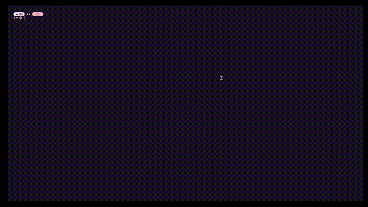

# ytascii

A lightweight terminal tool that plays YouTube videos in real-time as animated ASCII in your terminal window. Supports captions, looping, Fastfetch overlays, and terminal dimension control.

## Demo



## Fastfetch Demo


## Features

- Stream any YouTube video as ASCII
- Display captions inline
- Optional Fastfetch overlay (`--fastfetch-mode`)
- Loop playback (`--loop`)
- Custom resolution (`--width`, `--height`)
- Pause/Skip with keybindings: `p`, `q`, `f`, `b`, `c`

## Installation

### One-liner (Linux/macOS)

```bash
curl -s https://raw.githubusercontent.com/Delta-Dev-1/ytascii/main/install.sh | bash
```

### Manual

```bash
git clone https://github.com/Delta-Dev-1/ytascii.git
cd ytascii
chmod +x ytascii.py
sudo ln -s $PWD/ytascii.py /usr/local/bin/ytascii
```

## Dependencies

- `yt-dlp`
- `ffmpeg`, `ffplay`
- `python3`, `pip`
- Python modules: `Pillow`, `colorama`, `numpy`

### Arch Linux

```bash
sudo pacman -S ffmpeg python-pip
pip install yt-dlp Pillow colorama numpy
```

### Debian/Ubuntu

```bash
sudo apt install ffmpeg python3-pip
pip3 install yt-dlp Pillow colorama numpy
```

### macOS

```bash
brew install ffmpeg
pip3 install yt-dlp Pillow colorama numpy
```

## Usage

```bash
ytascii [options] <YouTube URL>
```

### Options

- `--fastfetch-mode` : Displays system info alongside the video
- `--loop` : Replay video after it ends
- `--width <int>` : Set output width
- `--height <int>` : Set output height

### Examples

```bash
ytascii "https://youtu.be/dQw4w9WgXcQ"
ytascii "https://youtu.be/NyanCat" --fastfetch-mode --width 60 --height 30 --loop
```

## Platform Support

- Linux
- macOS
- Windows (use WSL2 or Git Bash)

## License

MIT License

## Disclaimer

This tool may be demonstrated with short segments of copyrighted material (e.g. a 5-second clip of "Nyan Cat") under fair use for educational and demonstrative purposes only. All rights remain with the original creators.

Nyan Cat video/audio © 2011 Chris Torres (https://www.youtube.com/user/tsukikommie)  
Used under fair use for demonstrative and educational purposes.